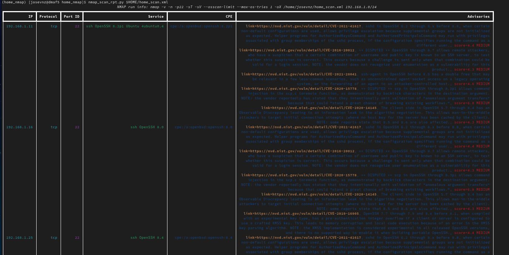

# Extending Ansible Inventories With Python

If you ever used Ansible, you know than one of its fundamental pieces is the [inventory](https://docs.ansible.com/ansible/latest/user_guide/intro_inventory.html); the inventory is nothing more than a list of machines and possibly variables where you can run your ansible playbooks.

An inventory file can be written in YAML, JSON or Windows INI format and can describe groups of machines as follows:

```yaml
---
all:
  children:
    servers:
      hosts:
        macmini2:
        raspberrypi:
      vars:
        description: Linux servers for the Nunez family
    desktops:
      hosts:
        dmaf5:
        mac-pro-1-1:
      vars:
        description: Desktops for the Nunez family
```

And you can confirm than it has the right structure too; for example filter only the machines that belong to the 'desktops' pattern:

```shell
[josevnz@dmaf5 ExtendingAnsibleWithPython]$ ansible-inventory --yaml --inventory /home/josevnz/EnableSysadmin/BashHere/hosts.yaml --graph desktops
@desktops:
  |--dmaf5
  |--mac-pro-1-1
```

Having a static YAML inventory may not be entirely practical for the following reasons:

1. You host inventory is really large. Admit it, you have better things to do than to edit YAML files, right?
2. Your inventory is on a format that is not compatible with Ansible YAML; It may be on a database, a plain text file
3. The servers that are part of your inventory is, well really dynamic; You create machines on your private cloud as you need them and their IP address change all the time, or you have a home network with lots of roaming devices (tables, phones). You want o maintain that by hand?

## What are you going to learn on this article?

There are many ways to manage your inventories in Ansible, will cover a few alternatives here:

* Converting inventories from legacy formats into Ansible
* Using dynamic inventories with plugins, specifically NMAP
* Writing our own inventory script to generate inventories dynamically
* Writing an Ansible inventory plugin

All this while following good practices of packaging our tools, using virtual environments and unit testing our code.

## Don't repeat yourself: Check first if someone wrote it for you!

And chances are they did. You can quickly see if someone wrote a plugin that can handle inventory from a different source like this:

```shell
ansible-doc -t inventory -l
```

For example:

```shell
[josevnz@dmaf5 ExtendingAnsibleWithPython]$ ansible-doc -t inventory -l
advanced_host_list  Parses a 'host list' with ranges                                                                                                                                                                     
auto                Loads and executes an inventory plugin specified in a YAML config                                                                                                                                    
aws_ec2             EC2 inventory source                                                                                                                                                                                 
aws_rds             rds instance source                                                                                                                                                                                  
azure_rm            Azure Resource Manager inventory plugin                                                                                                                                                              
cloudscale          cloudscale.ch inventory source                                                                                                                                                                       
constructed         Uses Jinja2 to construct vars and groups based on existing inventory                                                                                                                                 
docker_machine      Docker Machine inventory source                                                                                                                                                                      
docker_swarm        Ansible dynamic inventory plugin for Docker swarm nodes                                                                                                                                              
foreman             foreman inventory source                                                                                                                                                                             
gcp_compute         Google Cloud Compute Engine inventory source                                                                                                                                                         
generator           Uses Jinja2 to construct hosts and groups from patterns                                                                                                                                              
gitlab_runners      Ansible dynamic inventory plugin for GitLab runners                                                                                                                                                  
hcloud              Ansible dynamic inventory plugin for the Hetzner Cloud                                                                                                                                               
host_list           Parses a 'host list' string                                                                                                                                                                          
ini                 Uses an Ansible INI file as inventory source                                                                                                                                                         
k8s                 Kubernetes (K8s) inventory source                                                                                                                                                                    
kubevirt            KubeVirt inventory source                                                                                                                                                                            
linode              Ansible dynamic inventory plugin for Linode                                                                                                                                                          
netbox              NetBox inventory source                                                                                                                                                                              
nmap                Uses nmap to find hosts to target                                                                                                                                                                    
online              Online inventory source                                                                                                                                                                              
openshift           OpenShift inventory source                                                                                                                                                                           
openstack           OpenStack inventory source                                                                                                                                                                           
scaleway            Scaleway inventory source                                                                                                                                                                            
script              Executes an inventory script that returns JSON                                                                                                                                                       
toml                Uses a specific TOML file as an inventory source                                                                                                                                                     
tower               Ansible dynamic inventory plugin for Ansible Tower                                                                                                                                                   
virtualbox          virtualbox inventory source                                                                                                                                                                          
vmware_vm_inventory VMware Guest inventory source                                                                                                                                                                        
vultr               Vultr inventory source                                                                                                                                                                               
yaml                Uses a specific YAML file as an inventory source                          
```

### Host_list plugin

It is the simples one. You pass a list of machines or IP addresses, and you're good to go.
Let's try it with the ping module, and the remote user 'josevnz':

```shell
[josevnz@dmaf5 ExtendingAnsibleWithPython]$ cat /etc/hosts
127.0.0.1   localhost localhost.localdomain localhost4 localhost4.localdomain4
::1         localhost localhost.localdomain localhost6 localhost6.localdomain6
192.168.1.17 mac-pro-1-1
192.168.1.16 macmini2
192.168.1.11 raspberrypi

[josevnz@dmaf5 ExtendingAnsibleWithPython]$ cat /etc/hosts| /bin/cut -f1 -d' '|/bin/grep -P '^[a-z1]'
127.0.0.1
192.168.1.17
192.168.1.16
192.168.1.11

[josevnz@dmaf5 ExtendingAnsibleWithPython]$ ansible -u josevnz -i $(/bin/cat /etc/hosts| /bin/cut -f1 -d' '|/bin/grep -P '^[a-z1]'|/bin/xargs|/bin/sed 's# #,#g') -m ping all
127.0.0.1 | SUCCESS => {
    "changed": false,
    "ping": "pong"
}
192.168.1.11 | SUCCESS => {
    "changed": false,
    "ping": "pong"
}
192.168.1.16 | SUCCESS => {
    "changed": false,
    "ping": "pong"
}
192.168.1.17 | SUCCESS => {
    "changed": false,
    "ping": "pong"
}
```

No surprises here. But as you can see, this is not very convenient as we had to do a little but of Bash scripting to generate the hostlist; also the inventory is _static_.

Let's move on to a more interesting plug-ing, using [Nmap](https://nmap.org/)

### Nmap plugin

The [Nmap](https://docs.ansible.com/ansible/2.9/plugins/inventory/nmap.html) plugin allows you to use the well known network scanner to build your inventory list.

But first let's see how this works, by running nmap by hand

#### Crash course on Nmap
As a refresher, you can use [Nmap](https://nmap.org/) on the command line to get a very good idea of what machines and services are on your network:

```shell
[josevnz@dmaf5 ExtendingAnsibleWithPython]$ sudo nmap -v -n -p- -sT -sV -O --osscan-limit --max-os-tries 1 -oX $HOME/home_scan.xml 192.168.1.0/24
Starting Nmap 7.80 ( https://nmap.org ) at 2022-03-05 10:29 EST
NSE: Loaded 45 scripts for scanning.
Initiating ARP Ping Scan at 10:29
Scanning 254 hosts [1 port/host]
Completed ARP Ping Scan at 10:29, 5.10s elapsed (254 total hosts)
Nmap scan report for 192.168.1.0 [host down]
Nmap scan report for 192.168.1.2 [host down]
Initiating Connect Scan at 10:29
Scanning 4 hosts [65535 ports/host]
Discovered open port 443/tcp on 192.168.1.1
Discovered open port 8080/tcp on 192.168.1.1
Discovered open port 445/tcp on 192.168.1.1
Discovered open port 139/tcp on 192.168.1.1
Discovered open port 80/tcp on 192.168.1.1
Discovered open port 80/tcp on 192.168.1.4
Discovered open port 35387/tcp on 192.168.1.4
```

Keep in mind than the scan above is a time-consuming operation; You are checking every port and every possible host on your network, so this may take minutes _or even hours if you don't tune up your query_.

With that in mind, let's keep this useful links around, will use then to tune our arguments for Nmap:

* [NMAP Port Scanning Techniques](https://nmap.org/book/man-port-scanning-techniques.html)
* [NMAP Timing and Performance](https://nmap.org/book/man-performance.html).
* [NMAP Timing Templates (-T)](https://nmap.org/book/performance-timing-templates.html)

And for our inventory, we really care about machines where Ansible can SSH and perform operations. Limiting the port number to TCP 22 *will speed up considerable* our scanning:

```shell
# '-n': 'Never do DNS resolution',
# '-p-': 'All ports. Use -p22 to limit scan to port 22',
# '-sV': 'Probe open ports to determine service/version info',
# '-T4': 'Aggressive timing template',
# '-PE': 'Enable this echo request behavior. Good for internal networks',
# '--version-intensity 1': 'Set version scan intensity. Default is 7',
# '--disable-arp-ping': 'No ARP or ND Ping',
# '--max-hostgroup 100': 'Hostgroup (batch of hosts scanned concurrently) size',
# '--min-parallelism 20': 'Number of probes that may be outstanding for a host group',
# '--osscan-limit': 'Limit OS detection to promising targets',
# '--max-os-tries 1': 'Maximum number of OS detection tries against a target',
# '-oX -': 'Send XML output to STDOUT, avoid creating a temp file'
[josevnz@dmaf5 ExtendingAnsibleWithPython]$ nmap -v -n -p22 -sT -sV  --osscan-limit --max-os-tries 1 -oX $HOME/home_scan.xml 192.168.1.0/24
Starting Nmap 7.80 ( https://nmap.org ) at 2022-03-05 10:51 EST
NSE: Loaded 45 scripts for scanning.
Initiating Ping Scan at 10:51
Scanning 256 hosts [2 ports/host]
Completed Ping Scan at 10:51, 2.31s elapsed (256 total hosts)
Nmap scan report for 192.168.1.0 [host down]
Nmap scan report for 192.168.1.2 [host down]
Nmap scan report for 192.168.1.5 [host down]
Nmap scan report for 192.168.1.7 [host down]
...
Completed NSE at 10:51, 0.00s elapsed
Nmap scan report for 192.168.1.1
Host is up (0.0024s latency).

PORT   STATE  SERVICE VERSION
22/tcp closed ssh

Nmap scan report for 192.168.1.3
Host is up (0.070s latency).
...
Nmap scan report for 192.168.1.11
Host is up (0.00036s latency).
PORT   STATE SERVICE VERSION
22/tcp open  ssh     OpenSSH 8.2p1 Ubuntu 4ubuntu0.4 (Ubuntu Linux; protocol 2.0)
Service Info: OS: Linux; CPE: cpe:/o:linux:linux_kernel
...
Read data files from: /usr/bin/../share/nmap
Service detection performed. Please report any incorrect results at https://nmap.org/submit/ .
Nmap done: 256 IP addresses (8 hosts up) scanned in 2.71 seconds
```

But If we don't care at all about port scanning, then we can replace the '-p22' with the '-sn' (Ping scan) flag:

```shell
[josevnz@dmaf5 ExtendingAnsibleWithPython]$ time nmap -v -n -sn --osscan-limit --max-os-tries 1 -oX $HOME/home_scan.xml 192.168.1.0/24
Read data files from: /usr/bin/../share/nmap
Nmap done: 256 IP addresses (8 hosts up) scanned in 2.52 seconds
```

This small difference may be a factor for bigger networks, so for now will keep the port scanning on 22.

Finally, going forward I will not use the '-n' switch. If passed, the DNS resolution will be disabled, and we will never know the names of the machines we just scanned.

By now you are probably wondering, how you can extend Nmap? there are [many ways](https://github.com/josevnz/home_nmap/blob/main/tutorial/README.md), 
let me show you '[nmap_scan_rpt.py](https://github.com/josevnz/home_nmap/blob/main/scripts/nmap_scan_rpt.py)' script that can correlate your services with security advisories.

```shell
git clone git@github.com:josevnz/home_nmap.git $HOME/home_nmap.git
pushd home_nmap/
python3 -m venv $HOME/virtualenv/home_nmap/
. ~/virtualenv/home_nmap/bin/activate
nmap_scan_rpt.py $HOME/home_scan.xml
```



Feel free to play with the code, you can also run Nmap as a web service, but now let's move back to Ansible with Nmap

### The Ansible nmap plugin

Now we are ready to explore the [Ansible Nmap plugin](https://docs.ansible.com/ansible/latest/collections/community/general/nmap_inventory.html);

```yaml
# We do not want to do a port scan, only get the list of hosts dynamically
---
plugin: nmap
address: 192.168.1.0/24
strict: False
ipv4: yes
ports: no
groups:
  appliance: "'Amazon' in hostname"
  regular: "'host' in hostname"
```

Then let test it:

```shell
[josevnz@dmaf5 EnableSysadmin]$ ansible-inventory -i ExtendingAnsibleWithPython/Inventories/home_nmap_inventory.yaml --lis
```

That produces a nice JSON that will be consumed by Ansible:

```json
{
    "_meta": {
      "hostvars": {
        "android-1c5660ab7065af69.home": {
          "ip": "192.168.1.4",
          "ports": []
        },
        "dmaf5.home": {
          "ip": "192.168.1.26",
          "ports": []
        }
      },
      "all": {
        "children": [
          "ungrouped"
        ]
      },
      "ungrouped": {
        "hosts": [
          "android-1c5660ab7065af69.home",
          "dmaf5.home",
          "macmini2",
          "new-host-2.home",
          "new-host-6.home",
          "raspberrypi"
        ]
      }
    }
}
```

*NOTE*: I [could not get to work the jinja2 'groups' feature](https://stackoverflow.com/questions/61826110/dynamic-inventory-groups-from-ansible-plugin-nmap), to put hosts into dynamic groups based on their hostname.

That made think if there is another way to create an inventory using Nmap with Ansible. Time to write a wrapper script.

## Enter the world of dynamic inventory

Ansible documentation explains [new ways to generate dynamic inventories](https://docs.ansible.com/ansible/latest/user_guide/intro_dynamic_inventory.html); I decided to try writing a simple Python script that is a front-end to the Nmap command.

A few things before we dive in:
* Ansible encourage using plugins as the way to create dynamic inventories; If you decide to write a plugin, language is Python and you should read the [regular plugin documentation](https://docs.ansible.com/ansible/latest/dev_guide/developing_plugins.html#developing-plugins) first.
* If you decide to write a script, it is still supported AND you can use any language you want

To illustrate both approaches, we will write first a script that fetches hosts using Nmap.

The foundation of both approaches is a wrapper around the Nmap command:
1. NmapRunner executes the Nmap with the desired flags and captures the XML output
2. OutputParser parses the XML returns just the ip addresses we need
3. NMapRunner implements an [iterator](https://wiki.python.org/moin/Iterator), so we can go and process each address any way we see it fit.

Here is the code:

```python
import os
import shlex
import shutil
import subprocess
from typing import List, Dict
from xml.etree import ElementTree


class OutputParser:
    def __init__(self, xml: str):
        self.xml = xml

    def get_addresses(self) -> List[Dict[str, str]]:
        """
        Several things need to happen for an address to be included:
        1. Host is up
        2. Port is TCP 22
        3. Port status is open
        Otherwise the iterator will not be filled
        :return:
        """
        addresses = []
        root = ElementTree.fromstring(self.xml)
        for host in root.findall('host'):
            name = None
            for hostnames in host.findall('hostnames'):
                for hostname in hostnames:
                    name = hostname.attrib['name']
                    break
            if not name:
                continue
            is_up = True
            for status in host.findall('status'):
                if status.attrib['state'] == 'down':
                    is_up = False
                    break
            if not is_up:
                continue
            port_22_open = False
            for ports in host.findall('ports'):
                for port in ports.findall('port'):
                    if port.attrib['portid'] == '22':
                        for state in port.findall('state'):
                            if state.attrib['state'] == "open":  # Up not the same as open, we want SSH access!
                                port_22_open = True
                                break
            if not port_22_open:
                continue
            address = None
            for address_data in host.findall('address'):
                address = address_data.attrib['addr']
                break
            addresses.append({name: address})
        return addresses


class NmapRunner:

    def __init__(self, hosts: str):
        self.nmap_report_file = None
        found_nmap = shutil.which('nmap', mode=os.F_OK | os.X_OK)
        if not found_nmap:
            raise ValueError(f"Nmap is missing!")
        self.nmap = found_nmap
        self.hosts = hosts

    def __iter__(self):
        command = [self.nmap]
        command.extend(__NMAP__FLAGS__)
        command.append(self.hosts)
        completed = subprocess.run(
            command,
            capture_output=True,
            shell=False,
            check=True
        )
        completed.check_returncode()
        out_par = OutputParser(completed.stdout.decode('utf-8'))
        self.addresses = out_par.get_addresses()
        return self

    def __next__(self):
        try:
            return self.addresses.pop()
        except IndexError:
            raise StopIteration


"""
Convert the args for proper usage on the Nmap CLI
Also, do not use the -n flag. We need to resolve IP addresses to hostname, even if we sacrifice a little bit of speed
"""
NMAP_DEFAULT_FLAGS = {
    '-p22': 'Port 22 scanning',
    '-T4': 'Aggressive timing template',
    '-PE': 'Enable this echo request behavior. Good for internal networks',
    '--disable-arp-ping': 'No ARP or ND Ping',
    '--max-hostgroup 50': 'Hostgroup (batch of hosts scanned concurrently) size',
    '--min-parallelism 50': 'Number of probes that may be outstanding for a host group',
    '--osscan-limit': 'Limit OS detection to promising targets',
    '--max-os-tries 1': 'Maximum number of OS detection tries against a target',
    '-oX -': 'Send XML output to STDOUT, avoid creating a temp file'
}
__NMAP__FLAGS__ = shlex.split(" ".join(NMAP_DEFAULT_FLAGS.keys()))
```

For example, you could use the NmapRunner like this:

```python
import pprint
def test_iter():
    for hosts_data in NmapRunner("192.168.1.0/24"):
        pprint.print(hosts_data)
```

## Writing an inventory script

Ansible documentation [is very clear](https://docs.ansible.com/ansible/latest/dev_guide/developing_inventory.html#inventory-script-conventions) about the only 2 requirements we need for our script.
1. Must support --list and --host <hostname> excluding flag
2. Must return proper JSON for both of them
3. Other flags can be added but will not be used by Ansible

Wait a second. There is nothing in there that says than Ansible will provide the network to scan for hosts, how do we inject that?

To keep things simple, our script will be able to read a YAML configuration file on "/home/josevnz/.ansible/plugins/cliconf/nmap_plugin.yaml" with the following:

```yaml
# Sample configuration file
---
plugin: nmap_plugin
address: 192.168.1.0/24
```

The class that reads the code is quite simple:
```python
"""
Using a configuration file in YAML format, so it can be reused by the plugin.
Init file with ConfigParser is more convenient, trying to keep Ansible happy :wink:
"""
import os
from yaml import safe_load

try:
    from yaml import CLoader as Loader, CDumper as Dumper
except ImportError:
    from yaml import Loader, Dumper

def load_config(config_file: str = os.path.expanduser("~/.ansible/plugins/cliconf/nmap_inventory.cfg")):
    """
    Where to copy the configuration file:
    ```shell
    [josevnz@dmaf5 EnableSysadmin]$ ansible-config dump |grep DEFAULT_CLICONF_PLUGIN_PATH
    DEFAULT_CLICONF_PLUGIN_PATH(default) = ['/home/josevnz/.ansible/plugins/cliconf', '/usr/share/ansible/plugins/cliconf']
    ```
    :param config_file:
    :return:
    """
    with open(config_file, 'r') as stream:
        data = safe_load(stream)
        return data
```

Very good, let's see some code now:

```python
#!/usr/bin/env python
"""
# nmap_inventory.py - Generates an Ansible dynamic inventory using NMAP
# Author
Jose Vicente Nunez Zuleta (kodegeek.com@protonmail.com)
"""
import json
import os.path
import argparse
from configparser import ConfigParser, MissingSectionHeaderError

from inventories.nmap import NmapRunner

def load_config() -> ConfigParser:
    cp = ConfigParser()
    try:
        config_file = os.path.expanduser("~/.config/nmap_inventory.cfg")
        cp.read(config_file)
        if not cp.has_option('DEFAULT', 'Addresses'):
            raise ValueError("Missing configuration option: DEFAULT -> Addresses")
    except MissingSectionHeaderError as mhe:
        raise ValueError("Invalid or missing configuration file:", mhe)
    return cp


def get_empty_vars():
    return json.dumps({})


def get_list(search_address: str, pretty=False) -> str:
    """
    All group is always returned
    Ungrouped at least contains all the names found
    IP addresses are added as vars in the __meta tag, for efficiency as mentioned in the Ansible documentation.
    Note than we can add logic here to put machines in custom groups, will keep it simple for now.
    :param search_address: Results of the scan with NMap
    :param pretty: Indentation
    :return: JSON string
    """
    found_data = list(NmapRunner(search_address))
    hostvars = {}
    ungrouped = []
    for host_data in found_data:
        for name, address in host_data.items():
            if name not in ungrouped:
                ungrouped.append(name)
            if name not in hostvars:
                hostvars[name] = {'ip': []}
            hostvars[name]['ip'].append(address)
    data = {
        '_meta': {
          'hostvars': hostvars
        },
        'all': {
            'children': [
                'ungrouped'
            ]
        },
        'ungrouped': {
            'hosts': ungrouped
        }
    }
    return json.dumps(data, indent=pretty)

if __name__ == '__main__':

    arg_parser = argparse.ArgumentParser(
        description=__doc__,
        prog=__file__
    )
    arg_parser.add_argument(
        '--pretty',
        action='store_true',
        default=False,
        help="Pretty print JSON"
    )
    mandatory_options = arg_parser.add_mutually_exclusive_group()
    mandatory_options.add_argument(
        '--list',
        action='store',
        nargs="*",
        default="dummy",
        help="Show JSON of all managed hosts"
    )
    mandatory_options.add_argument(
        '--host',
        action='store',
        help="Display vars related to the host"
    )

    try:
        config = load_config()
        addresses = config.get('DEFAULT', 'Addresses')

        args = arg_parser.parse_args()
        if args.host:
            print(get_empty_vars())
        elif len(args.list) >= 0:
            print(get_list(addresses, args.pretty))
        else:
            raise ValueError("Expecting either --host $HOSTNAME or --list")

    except ValueError:
        raise
```

You probably noticed a few things:
1. Most of the code on this script is dedicated to handling arguments and loading configuration, besides presenting the JSON
2. You could add grouping logic into get_list. For now, I'm populating the 2 default groups.

It is time to kick the tires now. Install the code first:

```shell
git clone git@github.com:josevnz/ExtendingAnsibleWithPython.git
cd ExtendingAnsibleWithPython/Inventory
python3 -m venv ~/virtualenv/ExtendingAnsibleWithPythonInventory
. ~/virtualenv/ExtendingAnsibleWithPythonInventory/bin/activate
pip install wheel
pip install --upgrade pip
pip install build
python setup.py bdist_wheel
pip install dist/*
```

The virtual environment should be active now, let's see if we get an empty host information (put the name of a machine in your network):

```shell
(ExtendingAnsibleWithPythonInventory) [josevnz@dmaf5 Inventories]$ ansible-inventory --inventory scripts/nmap_inventory.py --host raspberrypi
{}
```

Good, empty JSON expected as we did not implement the ```--host $HOSTNAME method```. What about ```--list```?:

```shell
(ExtendingAnsibleWithPythonInventory) [josevnz@dmaf5 Inventories]$ ansible-inventory --inventory scripts/nmap_inventory.py --list
{
    "_meta": {
        "hostvars": {
            "dmaf5.home": {
                "ip": [
                    "192.168.1.26",
                    "192.168.1.25"
                ]
            },
            "macmini2": {
                "ip": [
                    "192.168.1.16"
                ]
            },
            "raspberrypi": {
                "ip": [
                    "192.168.1.11"
                ]
            }
        }
    },
    "all": {
        "children": [
            "ungrouped"
        ]
    },
    "ungrouped": {
        "hosts": [
            "dmaf5.home",
            "macmini2",
            "raspberrypi"
        ]
    }
}
```

Finally, let's try our new inventory with the ping module:

```shell
(ExtendingAnsibleWithPythonInventory) [josevnz@dmaf5 Inventories]$ ansible --inventory scripts/nmap_inventory.py --user josevnz -m ping all
dmaf5.home | SUCCESS => {
    "changed": false,
    "ping": "pong"
}
raspberrypi | SUCCESS => {
    "changed": false,
    "ping": "pong"
}
macmini2 | SUCCESS => {
    "changed": false,
    "ping": "pong"
}
```

The last and final option, writing a plugin is next.

## Writing an Ansible module

The idea is to take advantage of Ansible ecosystem for common tasks like execution and caching, as [explained in the documentation](https://docs.ansible.com/ansible/latest/dev_guide/developing_inventory.html#developing-an-inventory-plugin).

I will take advantage of the parser and Nmap wrapper I wrote earlier, so the module file will have those classes embedded as well.

We need to add 'Ansible' as a dependency to make our development easier (```requirements.txt```):

```text
setuptools>=60.5.0
build>=0.7.0
packaging==21.3
wheel==0.37.1
pip-audit==2.0.0
ansible==5.4.0
```

And install it (it is a HEAVY package, so you should go a grab a coffee):
```shell
# Also you can:
# pip install ansible==5.4.0
pip install -r requirements.txt
```


